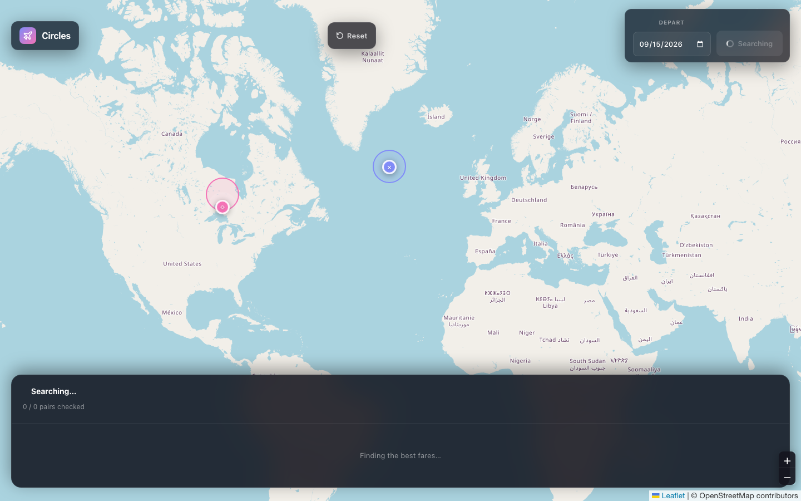
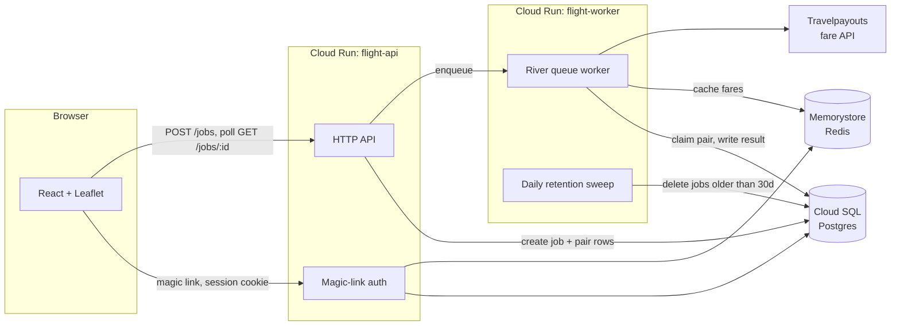

# Circle Search

Draw two circles on a map — one around where you'd fly from, one around where you'd fly to — pick a date range, and it searches every reachable airport pair inside them for the cheapest one-way fare.

**Live demo:** https://circle-search-508212.web.app *(gated to allowlisted emails — see [Demo access](#demo-access))*



## Why circles

Flight search tools make you commit to exact airports before they'll tell you anything. If you're flexible — "somewhere near NYC to somewhere near London" — you end up opening a dozen tabs, one per airport pair, by hand. Circle Search does that fan-out for you: draw two regions, get back the cheapest fare across every valid pair inside them, sorted.

## How it works

1. **Draw circles.** Origin and destination, each with a radius, plus a departure date range.
2. **Submit.** The backend resolves every airport inside each circle, filters to pairs with a real route between them (direct, or one hop through a major hub if there's no direct route), and expands that into every `(origin, destination, date)` tuple — capped at 5,000 pairs per job.
3. **Search fans out.** Each tuple becomes a background job on a Postgres-backed queue, rate-limited and cached so a popular search doesn't hammer the fare provider or your wallet.
4. **Results stream in.** The frontend polls the job and renders fares as they complete — cheapest first, each with a real booking link.

## Architecture



Two independent Cloud Run services share one Postgres database via [River](https://riverqueue.com/): `flight-api` handles HTTP and auth, `flight-worker` drains the `search` queue, rate-limited to be gentle with the fare provider's free tier. Fare lookups are cached in Redis by `(origin, destination, date)` so repeat searches inside the cache TTL are free and instant.

## Stack

- **Backend:** Go, [River](https://riverqueue.com/) (Postgres-backed job queue), `pgx`, `go-redis`
- **Frontend:** React, Vite, Leaflet (the map), TanStack Query, Tailwind
- **Auth:** Passwordless magic links (no passwords, no OAuth dependency) — see [Auth](#auth)
- **Infra:** Cloud Run ×2, Cloud SQL (Postgres), Memorystore (Redis), Firebase Hosting, Secret Manager, GitHub Actions (build/test CI + manual-trigger deploy via Workload Identity Federation — no service account keys)

## Auth

No passwords. Request a magic link, click it, you're in for 30 days. Two things worth knowing:

- **The demo is allowlist-gated.** `ALLOWED_EMAILS` on `flight-api` restricts who can request a link at all — this isn't a public sign-up product, it's a demo. See [Demo access](#demo-access) to get added.
- **Email delivery uses Resend's test sender**, which only delivers to the Resend account owner's own address. That's a deliberate trade-off for a demo gated by an allowlist, not a production email setup — see [What's not production-ready](#whats-not-production-ready).

## Demo access

The live demo only sends magic links to allowlisted addresses. If you want to try it, ask for your email to be added — it's a one-line `gcloud run services update` away, not a code change.

## Local development

Requires Go 1.26+, Node 20+, and Docker.

```bash
# 1. Postgres + Redis
docker compose up -d

# 2. Backend — two processes, each needs its own port locally
#    (in production these are separate Cloud Run services, so this
#    only matters when running both on one machine)
go run ./cmd/api                       # :8080
API_ADDR=:8081 go run ./cmd/worker     # :8081

# 3. Frontend
cd frontend && npm install && npm run dev   # :5173
```

Without `RESEND_API_KEY` set, magic links are logged to the API's stdout instead of emailed — copy the link from the terminal to log in locally. Without `TRAVELPAYOUTS_API_KEY`, the worker starts but every search dead-letters.

### Tests

```bash
go test -race ./...                    # backend
cd frontend && npm run build && npm run lint
npm run test:debug && npm run test:e2e # Playwright, fully mocked — no backend needed
```

`tests/e2e/live-*.spec.ts` are separate: they hit a real running backend and real fare data, and aren't part of CI. Run them with `npm run test:e2e:live` against a backend started with `E2E_TEST_MODE=true` (that flag enables a test-only token endpoint so Playwright can authenticate without a real inbox — see `internal/http/auth_handlers.go`'s `IssueTestToken`; it's never set in any real deployment).

## Deployment

Deploys are manual-trigger on purpose — merging to `main` never ships automatically:

```bash
gh workflow run deploy.yml -f target=all   # or: api / worker / frontend
```

GitHub Actions authenticates to GCP via Workload Identity Federation — no service account key ever leaves Google's infrastructure. Both Cloud Run services run under a dedicated `flight-runtime` service account scoped to exactly the Secret Manager secrets and Cloud SQL access they need, not the project-wide default.

## What's not production-ready

Being direct about the gaps, rather than letting the demo imply more than it is:

- **Fare data is real but not live GDS pricing.** Travelpayouts' free tier returns aggregated/cached third-party data. Every alternative investigated (Amadeus, AeroDataBox, Duffel, FlightAPI.io) either doesn't cover fares, requires a paid partner tier, or has since shut down its free tier — see `NEXT_STEPS.md` for the full trade-off writeup.
- **Email delivery is demo-only** (see [Auth](#auth)) — a real launch needs a verified sending domain.
- **No infrastructure-as-code.** Everything was provisioned by hand via `gcloud`/`firebase` on purpose, to actually learn the primitives. Worth Terraforming before handing this to anyone else to operate.
- **No staging environment, no alerting beyond Cloud Run's own dashboards.** Fine at solo-demo scale; not fine with real users.
- **The world-hub list** (`internal/jobengine.DefaultHubs`) was never reconciled against the original target city list — functionally fine, cosmetically incomplete.

Full prioritized backlog: [`NEXT_STEPS.md`](./NEXT_STEPS.md).

## API

All endpoints except auth require a valid session cookie.

| Method | Path | |
|---|---|---|
| `POST` | `/v1/auth/magic-link` | `{email}` → sends a magic link (allowlist-gated) |
| `GET` | `/v1/auth/callback?token=` | Exchanges a magic-link token for a session cookie |
| `POST` | `/v1/auth/logout` | Clears the session |
| `POST` | `/jobs` | Submits a circle search — see `SearchRequest` in `internal/jobengine/types.go` |
| `GET` | `/jobs/{id}?include=results` | Polls job status; `include=results` returns per-pair fares as they complete |
| `GET` | `/readyz` | Postgres + Redis reachability — what the demo scripts and deploy checks actually probe |
